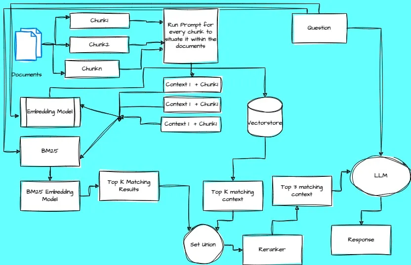

# Webinar CRAG

Este proyecto consiste en la creación de un Contextual RAG:
1. Creación del contexto de cada chunk del PDF.
2. Guardado en Chroma y BM25.
3. Recuperación con ReRanker.



## Estructura de carpetas

```plaintext
📦 webinar_crag
├── 📁 app                         # Código de la aplicación
│   ├── 📁 chatbot    
│   │   ├── 📄 __init__.py         # Convierte un directorio en un paquete
│   │   ├── 📄 chatbot.py          # Clase del agente RAG 
│   │   └── 📄 prompt.py           # Prompts del sistema
│   ├── 📁 tools                   # Herramientas 
│   │   ├── 📄 __init__.py         # Convierte un directorio en un paquete
│   │   ├── 📄 retrieve.py         # Codigo para recuperacion desde Chroma
│   │   └── 📄 tools.py            # Herramientas (logger)
│   ├── 📄 front.py                # Aplicación Chainlit original
│   └── 📄 chainlit_app.py        # Aplicación Chainlit standalone
│
├── 📁 rag                         # Módulo RAG para creación y recuperación
│   ├── 📄 __init__.py             # Convierte un directorio en un paquete
│   ├── 📄 create_vectordb.py      # Script para crear la base de datos vectorial
│   └── 📄 retrieve_db.py          # Script para recuperar documentos de la BD
│
├── 📁 data                        # Carpeta con los PDFs, se guarda aquí Chroma y BM25
│   ├── 📄 thinking_systems_from_donella_meadows.pdf
│   ├── 📁 chroma_db               # Base de datos Chroma (generada)
│   └── 📄 *_bm25                  # Archivos BM25 (generados)
│
├── 📁 imgs                        # Carpeta con las imágenes usadas
│   └── 📄 crag.webp
│
├── 📁 notebooks                   # Carpeta de notebooks de prueba
│   └── 📄 CRAG.ipynb              # Jupyter notebook con todo el proceso
│
├── 📁 venv                        # Entorno virtual (no se versiona)
│
├── 📄 .gitignore                  # Archivos y carpetas a ignorar en Git
├── 📄 README.md                   # Documentación principal del proyecto
└── 📄 requirements.txt            # Dependencias y configuración 
```

### Descripción de carpetas principales

- **`app/`**: Contiene el código de la aplicación Chainlit. Incluye el chatbot, herramientas y dos versiones de la aplicación frontend.
- **`rag/`**: Módulo RAG que contiene los scripts para crear y recuperar documentos de la base de datos vectorial.
- **`data/`**: Almacena los PDFs de entrada y los archivos generados (Chroma DB y BM25).
- **`notebooks/`**: Contiene el notebook Jupyter con el proceso completo de desarrollo.

## Dependencias

1. **Activación del entorno virtual**

    Activar el entorno virtual usado el siguiente comando:

    ```bash
    source .venv/bin/activate
    ```

    También puede usarse conda y crear un entorno virtual con:
     ```bash
    conda create -n sql python=3.12
    ```

2. **Sincronizar dependencias con pip**:

    ```bash
    pip install -r requirements.txt
    ```

    Este comando instala las dependencias en el entorno virtual definidas en el archivo `requirements.txt`. 

## Variables de entorno

Este proyecto necesita obtener una API KEY de OpenAI [aqui](https://platform.openai.com/api-keys).

`OPENAI_API_KEY = 'sk-WrrN..................'`


## Proceso de instalación y uso

1. Instalar dependencias con el archivo `requirements.txt` usando el siguiente comando:
    ```bash
    pip install -r requirements.txt
    ```

2. Crear la base de datos vectorial desde los PDFs:
    ```bash
    python rag/create_vectordb.py
    ```
    Esto procesará los PDFs en la carpeta `data/` y creará:
    - Base de datos Chroma en `data/chroma_db/`
    - Archivos BM25 en `data/`

3. Levantar el front de chainlit de la carpeta app con el siguiente comando:
    ```bash
    # Opción 1: Usando la aplicación original
    chainlit run app/front.py -w --port 8001
    
    # Opción 2: Usando la aplicación standalone
    chainlit run app/chainlit_app.py -w --port 8001
    ```

4. (Opcional) Probar la recuperación de documentos:
    ```bash
    python rag/retrieve_db.py
    ```

